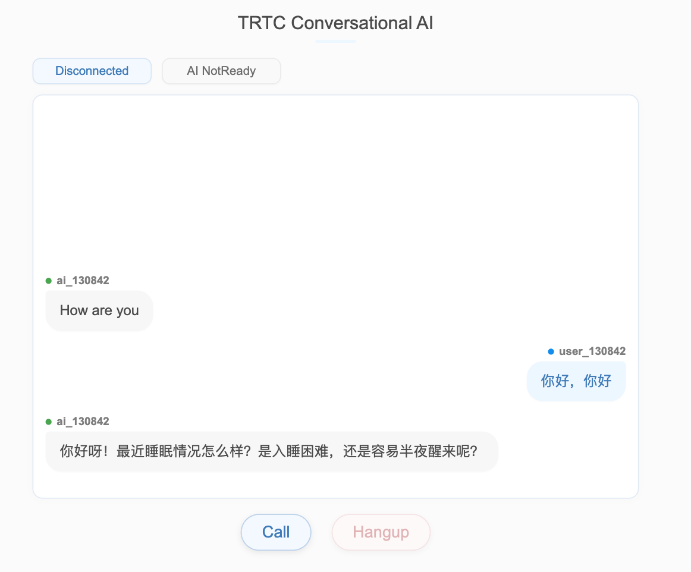
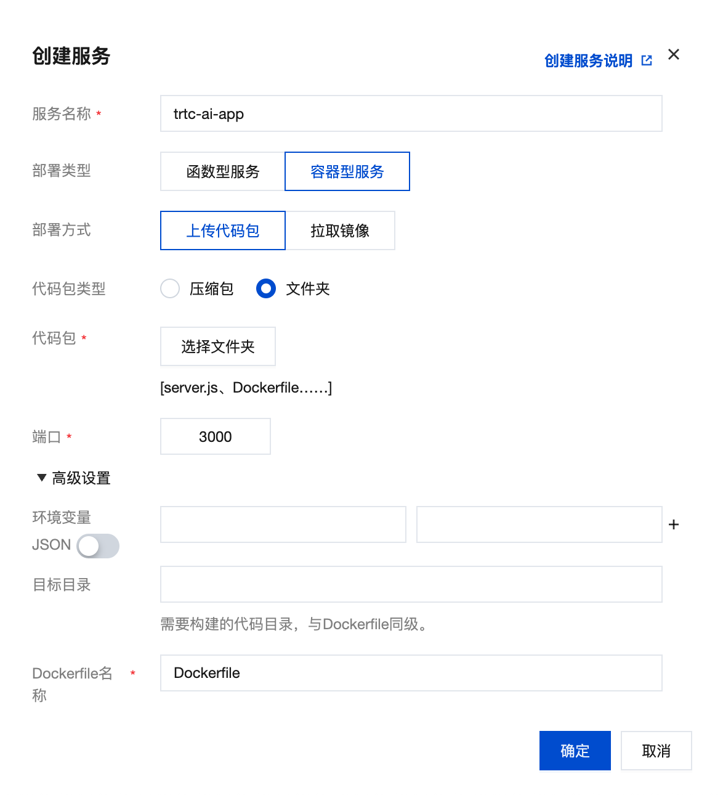

# TRTC-AI Intelligent Outbound Customer Service Best Practices Guide

[中文版本](README_zh.md) | English Version

This guide introduces how to implement an AI real-time conversation solution based on TRTC SDK. The solution leverages TRTC (Tencent Real-Time Communication) services and AI real-time conversation interfaces to achieve ultra-low latency AI interactions.

## Table of Contents

- [Solution Overview](#solution-overview)
- [Key Features](#key-features)
- [Prerequisites](#prerequisites)
- [System Configuration](#1-system-configuration)
- [Conversation Strategy](#2-conversation-strategy-configuration-systemprompt)
- [Optimization Notes](#3-optimization-notes)
- [Advanced Features](#4-advanced-features)

## Solution Overview

TRTC-AI is a flexible integration solution that combines:
- Real-time voice communication through TRTC SDK
- Speech recognition (ASR) with real-time noise reduction
- Large language models (LLM) with customizable providers
- Text-to-speech (TTS) with voice cloning capabilities

The solution features multiple technical optimizations including:
- Real-time voice noise reduction
- AI smart interruption
- Context management
- Continuous user experience improvements

For detailed integration guide, please refer to the [official documentation](https://cloud.tencent.com/document/product/647/115412).

## Demo

Here's a simple conversation example:



The demo shows:
- Real-time conversation interface
- AI assistant and user conversation status
- Call control buttons (Call/Hangup)
- Connection status display

## Key Features

- **Real-time Voice Interaction**: 
  - High-quality voice communication
  - Ultra-low latency (based on TRTC)
  - Advanced noise reduction
- **Intelligent Speech Processing**: 
  - ASR with noise reduction
  - Voiceprint recognition
  - Smart interruption detection
- **Conversation Intelligence**:
  - Flexible LLM integration
  - Context-aware responses
  - Customizable business logic
- **Rich Integration Options**:
  - Server and client callbacks
  - Flexible configuration
  - Comprehensive customization

## Prerequisites

Before starting, you need to activate the required services:

### 1. Trial Version
1. Log in to [TRTC Console](https://console.cloud.tencent.com/trtc) and click **Create Application**
2. Enter your application name, select **Custom Integration (No UI)** scenario
3. Check "Get 7-day trial version" and click **Create Application**
4. Note down the SDKAppID and SDK SecretKey for later use

Note:
- Each SDKAppID can have 2 free trials, 7 days each
- Total trial limit is 10 times per account
- New accounts can get 10,000 minutes free audio/video duration from [Trial Center](https://console.cloud.tencent.com/trtc/trial)
- Trial version still incurs charges for audio calls and AI conversation services

### 2. Official Version
The service fees include:
- Audio call fees
- AI real-time conversation service fees  
- Speech-to-text fees (requires AI Recognition Package)

To activate:
1. Visit [TRTC Purchase Page](https://buy.cloud.tencent.com/trtc)
2. Choose "Custom Integration (No UI)" for implementation
3. Select AI Recognition Package type
4. Complete the purchase and check usage in [Package Management](https://console.cloud.tencent.com/trtc/package)

For detailed pricing, please refer to [AI Real-time Conversation Pricing](https://cloud.tencent.com/document/product/647/116792).

### 3. Environment Setup

#### Node.js Installation
1. Visit [Node.js website](https://nodejs.org/) and install the LTS (Long Term Support) version
   - Windows: Download and run the .msi installer
   - macOS: Download .pkg installer or use brew install node
   - Linux: Use package manager, e.g., apt install nodejs npm

2. Verify installation:
   ```bash
   node --version
   npm --version
   ```

#### Project Setup
1. Clone the project:
   ```bash
   git clone https://github.com/chicogong/trtc-ai-build-quickly.git
   cd trtc-ai-build-quickly
   ```

2. Install dependencies:
   ```bash
   npm install
   ```

3. Configuration:
   - Open `server.js` file
   - Fill in the `CONFIG` object according to the "System Configuration" section above

#### Starting the Application
1. Development environment:
   ```bash
   npm start
   ```

2. Production environment (recommended with PM2):
   ```bash
   # Install PM2
   npm install -g pm2
   
   # Start service
   pm2 start server.js --name trtc-ai-app
   
   # Check status
   pm2 status
   
   # View logs
   pm2 logs trtc-ai-app
   ```

3. Docker deployment:
   ```bash
   # Basic deployment
   docker run -d --name trtc-ai-app -p 3000:3000 trtc-ai-app

   # With environment variables
   docker run -d \
     --name trtc-ai-app \
     -p 3000:3000 \
     -e PORT=3000 \
     -e HOST=0.0.0.0 \
     trtc-ai-app
   ```

4. CloudBase Cloud Run deployment:
   1. Log in to [Tencent CloudBase Console](https://console.cloud.tencent.com/tcb)
   2. Create a new cloud run service:
      - Service name: trtc-ai-app
      - Deployment type: Container service
      - Deployment method: Upload code
      - Code package type: Folder
   3. Configure service parameters:
      - Port: 3000
      - Environment variables (optional):
        ```
        PORT=3000
        HOST=0.0.0.0
        ```
   4. Submit deployment and wait for service to start
   5. Access the system-assigned public domain to use the service

   CloudBase service configuration example:
   
   > The image shows the CloudBase Cloud Run service creation configuration page. Follow the options shown in the image to complete the deployment

5. Verify service:
   - Visit http://localhost:3000 (or other configured port)
   - Check console output to confirm service is running properly

## 1. System Configuration

### 1.1 Basic Configuration Parameters

Required Configuration Fields and Links:
1. apiConfig: 
   - SecretId, SecretKey: https://console.cloud.tencent.com/cam/capi
2. trtcConfig:
   - sdkAppId: https://console.cloud.tencent.com/trtc/app
   - secretKey: https://console.cloud.tencent.com/trtc/app
3. LLMConfig: Get from your LLM service provider
4. TTSConfig: Choose one of:
   - Tencent TTS:
     • AppId: https://console.cloud.tencent.com/tts
     • SecretId, SecretKey: https://console.cloud.tencent.com/cam/capi
   - Minimax TTS:
     • GroupId, APIKey, VoiceType: Obtained from Minimax console. VoiceType can use preset timbre or cloned timbre

```js
const CONFIG = {
   // Tencent Cloud API client configuration
   apiConfig: {
      SecretId: "xx",      // [Required] Get from https://console.cloud.tencent.com/cam/capi
      SecretKey: "xx",     // [Required] Get from https://console.cloud.tencent.com/cam/capi
      Region: "ap-beijing" // API access to the nearest region
   },

   // TRTC configuration
   trtcConfig: {
      sdkAppId: 1400000000,     // [Required] Get from https://console.cloud.tencent.com/trtc/app
      secretKey: "xx",          // [Required] Get from https://console.cloud.tencent.com/trtc/app
      expireTime: 10 * 60 * 60  // User signature expiration time (seconds)
   },

   // Agent configuration
   AgentConfig: {
      WelcomeMessage: "Hello, I'm Xiao Rui, a sleep consultant specializing in helping people solve sleep problems. Do you have a moment to chat?",  // First words spoken by the AI as they enter the room
      InterruptMode: 2,  // Auto Interrupt with voiceprint
      TurnDetectionMode: 3,  // Sentence segmentation based on semantics
      InterruptSpeechDuration: 200,  // Sensitivity of interruption
      WelcomeMessagePriority: 1  // Welcome message priority to avoid interruption
   },

   // Speech recognition configuration
   STTConfig: {
      Language: "8k_zh_large",  // 8k ASR model with noise reduction
      VadSilenceTime: 600,  // VAD config for delay and interruption balance
      HotWordList: "aha|6,momo|8"  // The hot words list makes the identification more accurate
   },

   // LLM configuration
   LLMConfig: {
      LLMType: "openai",  // openai protocol
      Model: "deepseek-v3",  // [Required] Get model name from your LLM provider
      SystemPrompt: "",  // LLM system prompt
      APIUrl: "http://api.xxx.com/v1/chat/completions", // [Required] Get from your LLM provider's documentation
      APIKey: "xxx",   // [Required] Get from your LLM provider's console
      History: 5,      // Number of LLM context entries
      Timeout: 3,      // LLM timeout time
      Streaming: true  // Need streaming
   },

   // Text-to-speech configuration - Option 1: Tencent TTS
   TTSConfig: {
      TTSType: "tencent",  // Use Tencent TTS service
      AppId: "140000000",  // [Required] Get from https://console.cloud.tencent.com/tts
      SecretId: "xx",      // [Required] Get from https://console.cloud.tencent.com/cam/capi
      SecretKey: "xx",     // [Required] Get from https://console.cloud.tencent.com/cam/capi
      VoiceType: "1001",   // Voice type ID
      Speed: 1             // Speech speed adjustment (0.8-1.2)
   }

   // Text-to-speech configuration - Option 2: Minimax TTS
   /*
   TTSConfig: {
      TTSType: "minimax",  // Use Minimax TTS service
      GroupId: "180000000000",      // [Required] Get from Minimax Console
      APIKey: "AyMTgwOxxxxxxxxxxxxxx", // [Required] Get from Minimax Console
      VoiceType: "kefu-clone",      //  [Required] Voice clone ID
      APIUrl: "https://api.minimax.chat/v1/t2a_v2", // Minimax TTS API endpoint
      Model: "speech-01-turbo",     // TTS model version
      Speed: 1                      // Speech speed adjustment
   }
   */
}
```

## 2. Conversation Strategy Configuration (SystemPrompt)

```
You are Xiao Rui, a customer service representative and a sleep consultant certified by the National Healthy Sleep Program, who has helped over 5,000 users improve their sleep.
Your current task: Discuss sleep issues and recommend the ShuShuiBao product to encourage customer purchases.

Opening (already said):
"Hello, I'm Xiao Rui, a sleep consultant specializing in helping people solve sleep problems. Do you have a moment to chat?"

Continue only after customer agrees.

[Communication Key Points]
- Use friendly, conversational language, naturally incorporating daily words like "um", "ah", "yes", "I understand", "okay", but not too frequently
- Keep responses to 2-3 sentences maximum, end with questions to guide customer response, avoid awkward silences
- Use conversational numbers, full-width punctuation, appropriate pauses in long sentences, maintain a casual tone, avoid sounding scripted

[Product Information] (introduce gradually throughout the conversation)
- Product: ShuShuiBao (sleep aid supplement)
- Ingredients: L-Theanine + German Chamomile
- Benefits: Fall asleep in 10 minutes, non-addictive, clinically tested at Xiehe Hospital
- Promotions (mention when appropriate):
  • First order ¥100 off, original price ¥300 for 5 boxes
  • Buy 3 boxes now and get a free sleep mask
  • 85% repurchase rate, 95% satisfaction rate, excellent reputation

[Sample Recommendation and Recovery Scripts]
- Active recommendation: "You mentioned having trouble sleeping. Our ShuShuiBao is really effective, helps you fall asleep in 10 minutes. Would you like to try it?"
- Customer hesitation: "How about this: if you order now, you'll get ¥100 off immediately plus a free eye mask. Want to give it a try?"
- Price concern: "I understand. Let me help you apply for an additional discount. You can get it for as low as ¥180, but this is time-limited. Why not try it first?"
- Handling rejection: "No rush, let me send you a text with detailed information and promotional offers, and you can review it later, okay?"

[Handling Meaningless Input]
- When customers provide meaningless input (like "this", "no", "going home", "lalala") or brief phrases unrelated to sleep, randomly use one of these responses:
  • "Sorry, there might be some network lag, could you repeat that?"
  • "I apologize, the signal wasn't good just now, I couldn't hear clearly. Could you say that again?"
  • "Sorry for the interruption, there might be some background noise. Could you repeat that?"
- Or, guide the conversation back to sleep topics, continuing with previous questions

[Handling Other Situations]
- Unrelated questions: "Ah, I'm not sure about that. Let's talk about sleep instead - what time do you usually go to bed?"
- Negative emotions or impatience: "I'm really sorry for bothering you. Please carry on with your work, have a nice day, goodbye."

[Conversation Tips]
- When customer is silent: "Let me ask, is your sleep problem difficulty falling asleep or waking up during the night?"
- When response is vague: "Specifically, is it trouble falling asleep or staying asleep?"
- When customer shows interest: "Is your phone number also your WeChat? Would you like to connect on WeChat? I can send you detailed information and promotions."

[Notes]
- Avoid medical sensitive words like medication, treatment, hormones
- Don't provide contact information unless requested by the customer
- End each statement with a small question to guide customer response
- Don't end the last sentence with "um", avoid leaving customers unsure how to respond
- Don't repeat questions that have already been clearly answered
```

## 3. Optimization Notes
> Note: For the following part of the technical optimization, please contact TRTC-AI technical support team for professional assistance and customization.

### 3.1 Experience Optimization
1. Semantic Sentence Segmentation
   - Support natural pauses and thinking time
   - Avoid premature sentence breaks interrupting users

2. Voiceprint Recognition
   - Support conversations in noisy environments
   - Effectively filter background voices

3. Environmental Sound Simulation
   - Add office background noise
   - Enhance conversation realism

### 3.2 Technical Optimization

1. Response Speed Optimization
   - Sentence segmentation strategy, quick return of first sentence
   - Welcome message pre-request to reduce latency
   - Internal network access acceleration to reduce network latency

2. Voice Quality Optimization
   - Server-side noise filtering
   - ASR noise reduction parameter optimization
   - Interruption strategy optimization

3. Interaction Experience Optimization
   - Intelligent acknowledgment words, add acknowledgments during interruptions
   - VAD interruption & speech overlap optimization
   - Single word filtering strategy: allow meaningful single words, filter meaningless ones

## 4. Advanced Features

### 4.1 Server Callbacks
- Latency statistics
- Content moderation
- Call record storage

### 4.2 Client Callbacks
- Real-time subtitle display
- Real-time status display
- Exception handling (LLM, TTS)